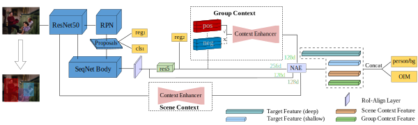
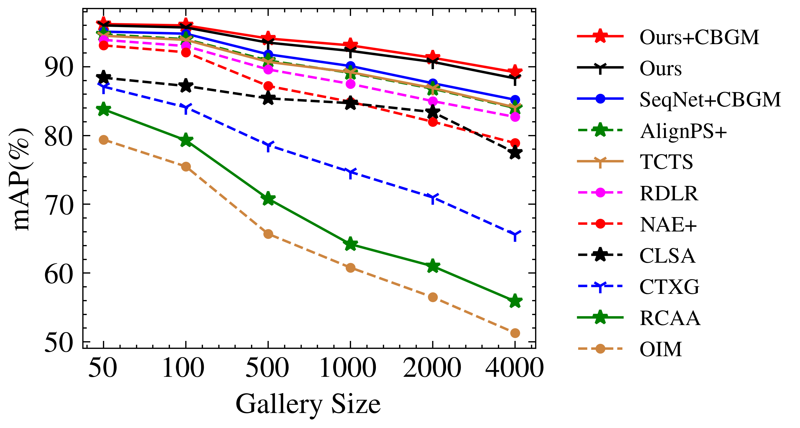
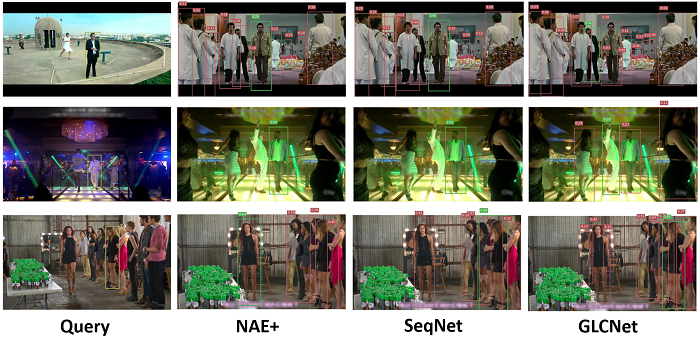

### Approach

Person  search  aims  to  jointly  localize  and  identify  a query person from natural,  uncropped images,  which has been  actively  studied  in  the  computer  vision  community over the past few years. In this paper, we delve into the rich context  information  globally  and  locally  surrounding  the target person, which we refer to scene and group context,respectively. Unlike previous works that treat the two types of context individually, we exploit them in a unified global-local  context  network  (**GLCNet**)  with  the  intuitive  aim  of feature enhancement.   Specifically,  re-ID embeddings and context  features  are  enhanced  simultaneously  in  a  multi-stage fashion, ultimately leading to enhanced, discriminative features for person search. We conduct the experiments on two person search benchmarks (i.e., CUHK-SYSU and PRW) as well as extend our approach to a more challenging setting (i.e., **character search on MovieNet**).  Extensive experimental results demonstrate the consistent improvement of the proposed GLCNet over the state-of-the-art methods on the three datasets.

+ Overall architecture of our GLCNet.

### Performance

|   Methods   | CUHK-SYSU | CUHK-SYSU |   PRW    |   PRW    |
| :---------: | :-------: | :-------: | :------: | :------: |
|      -      |    mAP    |   top-1   |   mAP    |  top-1   |
|     OIM     |   75.5    |   78.7    |   21.3   |   49.4   |
|    NAE+     |   92.1    |   92.9    |   44.0   |   81.1   |
|    TCTS     |   93.9    |   95.1    |   46.8   |   87.5   |
| SeqNet+CBGM |   94.8    |   95.7    | **47.6** |   87.6   |
|   GLCNet    |   95.7    |   96.3    |   46.9   |   85.1   |
| GLCNet+CBGM | **96.0**  | **96.3**  | **47.6** | **88.0** |

+ Different gallery size on CUHK-SYSU.

+ Qualitative Results

    

### Train

`sh ./run_${DATASET}.sh`

### Test
`sh ./test_${DATASET}.sh`

### Inference
Run the `demo.py` to make inference on given images. GLCNet runs at 10.3 fps on a single Tesla V100 GPU with batch_size 3.

### Acknowledge

Thanks to the solid codebase from [SeqNet](https://github.com/serend1p1ty/SeqNet).

