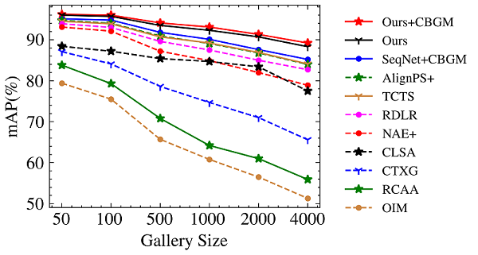

# GLCNet
This repo is the official implementation of "**GCoNet+: A Stronger Group Collaborative Co-Salient Object Detector**", ICASSP 2023.

[[arXiv](https://arxiv.org/abs/2112.02500)] [[code](https://github.com/ZhengPeng7/GLCNet)] [[stuff](https://drive.google.com/drive/folders/1wbq5jptOGxXDE0ze1tAMdcvXEaE1Wybt)]

[](https://paperswithcode.com/sota/person-search-on-cuhk-sysu?p=global-local-context-network-for-person) [](https://paperswithcode.com/sota/person-search-on-prw?p=global-local-context-network-for-person)

+ Abstract:

    Person search aims to jointly localize and identify a query person from natural, uncropped images, which has been actively studied over the past few years. In this paper, we delve into the rich context information globally and locally surrounding the target person, which we refer to as scene and group context, respectively. Unlike previous works that treat the two types of context individually, we exploit them in a unified global-local context network (GLCNet) with the intuitive aim of feature enhancement. Specifically, re-ID embeddings and context features are simultaneously learned in a multi-stage fashion, ultimately leading to enhanced, discriminative features for person search. We conduct the experiments on two person search benchmarks (i.e., CUHK-SYSU and PRW) as well as extend our approach to a more challenging setting (i.e., character search on MovieNet). Extensive experimental results demonstrate the consistent improvement of the proposed GLCNet over the state-of-the-art methods on all three datasets. Our source codes, pre-trained models, and the new dataset are publicly available at: [this https URL](https://github.com/ZhengPeng7/GLCNet).

+ Overall architecture of our GLCNet:


### Performance

|                      Datasets                       | CUHK-SYSU | CUHK-SYSU |   PRW    |   PRW    |
| :-------------------------------------------------: | :-------: | :-------: | :------: | :------: |
|                     **Methods**                     |    mAP    |   top-1   |   mAP    |  top-1   |
| [OIM](https://github.com/serend1p1ty/person_search) |   75.5    |   78.7    |   21.3   |   49.4   |
|     [NAE+](https://github.com/DeanChan/NAE4PS)      |   92.1    |   92.9    |   44.0   |   81.1   |
|                        TCTS                         |   93.9    |   95.1    |   46.8   |   87.5   |
|   [AlignPS+](https://github.com/daodaofr/AlignPS)   |   94.0    |   94.5    |   46.1   |   82.1   |
|   [SeqNet](https://github.com/serend1p1ty/SeqNet)   |   93.8    |   94.6    |   46.7   |   83.4   |
|                     SeqNet+CBGM                     |   94.8    |   95.7    | **47.6** |   87.6   |
|                       GLCNet                        |   95.5    |   96.1    |   46.7   |   84.9   |
|                     GLCNet+CBGM                     | **95.8**  | **96.2**  | **47.8** | **87.8** |

+ Different gallery size on CUHK-SYSU:



+ Qualitative Results:

    

### Env

```
python=3.8
PyTorch==1.13.1
torchvision==0.14.1
pip install scipy tabulate scikit-learn yacs fvcore tensorboard
```

### Train

`sh ./run_${DATASET}.sh CUDA_DEVICE`

### Test
`sh ./test_${DATASET}.sh CUDA_DEVICE`

### Inference
Run the `demo.py` to make inference on given images. GLCNet runs at **10.3 fps** on a single Tesla V100 GPU with batch_size 3.

### Weights

You can download our well-trained models -- cuhk_957.pth and prw_469.pth from [my google-drive folder for GLCNet](https://drive.google.com/drive/folders/1wbq5jptOGxXDE0ze1tAMdcvXEaE1Wybt?usp=sharing). 

### MovieNet-CS

To extend person search framework to a more challenging task, i.e., character search (CS). We borrow the character detection and ID annotations from the [MovieNet](http://movienet.site/) dataset to organize MovieNet-CS, and set different levels of training set and different gallery size same as CUHK-SYSU. MovieNet-CS is saved exactly the same format and structure as CUHK-SYSU, which could be of great convenience to further research and experiments. If you want to use MovieNet-CS, please download movie frames on the official website of MovieNet and our reorganized annotations [here](https://drive.google.com/drive/folders/1kUr7v9_LUSSjW5PyNbGqaiM6peXNvbiU). `frames_CS.zip` is the set of frames where we eliminate the unused ones (much smaller size, 700k+ frames).

If you work on server, we highly recommend you to `pip install gdown` and use `gdown` to download the subsets of the `frames_CS.zip`, i.e., `frames_CS-1.zip ~ frames_CS-6.zip` and combine them together.

### Acknowledgement

Thanks to the solid codebase from [SeqNet](https://github.com/serend1p1ty/SeqNet).

### Citation

```bibtex
@inproceedings{GLCNet,
    author   = {Jie Qin and
                Peng Zheng and
                Yichao Yan and
                Quan Rong and
                Xiaogang Cheng and
                Bingbing Ni},
    title    = {MovieNet-PS: A Large-Scale Person Search Dataset in the Wild},
    booktitle  = ICASSP,
    year     = {2023}
}
```

